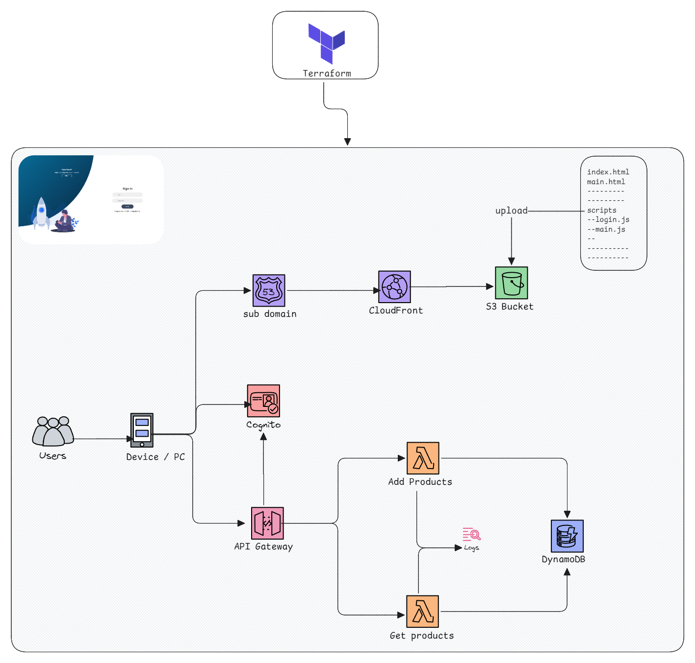

# Website Serverless Infrastructure on AWS

## Table of Contents

* [Overview](#overview)
* [Prerequisite](#prerequisite)
* [Architecture of the project](#architecture-of-the-project)
  * [Get Started with static website](simple_website/README.md)
  * [Get Started with Terraform configs](terraform/README.md)

## Overview

This project is to deploy an AWS serverless infrastructure and a static website using the IAC tools **Terraform** ,
The project mainly divided into two blocs; 
- The static website itself (_which I decide to not separate in a different repository_)
[Static Website](simple_website/README.md) 
- The Terraform configuration files [Terraform Configs](terraform/README.md)

## Prerequisite

In other to smoothly navigate into this project, these are the Technologies and tools used along :
- Understanding of website development with **(HTML, CSS, JavaScript)**
- Understanding of Terraform and his HCL configuration Language [Terraform Docs](https://developer.hashicorp.com/terraform?product_intent=terraform)
- A good level of understanding of this AWS Services that we configure using Terraform [AWS Docs](https://docs.aws.amazon.com)
    - S3
    - Lambda Function
    - Route53
    - Cloudfront
    - API Gateway
    - DynamoDB
    - Cloudwatch

## Architecture of the project
