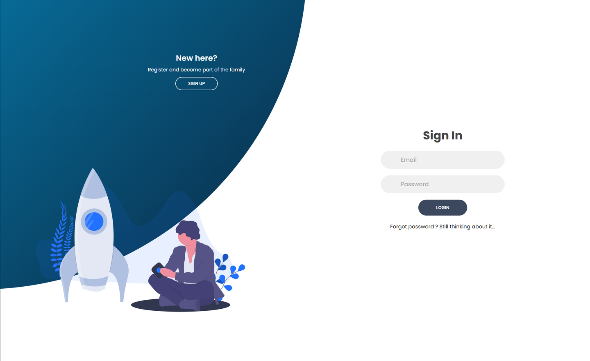

# Static Website 



## Overview

This repository contains the source code for a static website developed using HTML, CSS, and JavaScript. The website is hosted on AWS S3 and is configured with CloudFront for CDN distribution, Route 53 for DNS management, and Cognito for user authentication.

## Architecture

- **S3 Bucket**: Hosts the static website files.
- **CloudFront**: Provides CDN services for faster content delivery and caching.
- **Route 53**: Manages DNS records for the domain name.
- **Cognito**: Handles user authentication and management.

## Project Structure

- `index.html`: The main HTML file for the website.
- `css/`: Directory containing CSS files.
- `scripts/`: Directory containing JavaScript files.
- `assets/`: Directory for images used in the website.

## Deployment

The deployment of the website is managed using AWS services. Here is a high-level overview of the deployment process:

1. **S3 Bucket Setup**:
  - Create an S3 bucket and upload your static website files.
  - Configure the bucket for static website hosting.
  - Set appropriate bucket policies to allow public access.

2. **CloudFront Distribution**:
  - Create a CloudFront distribution with the S3 bucket as the origin.
  - Configure caching, SSL/TLS settings, and other distribution settings as needed.

3. **Route 53 Configuration**:
  - Create a hosted zone for your domain.
  - Add DNS records to point to the CloudFront distribution.

4. **Cognito User Authentication**:
  - Set up a Cognito user pool for user authentication.
  - Configure Cognito with the necessary sign-up and sign-in flows.
  - Integrate Cognito authentication into your website.

## Local Development

1. **Clone the Repository**:
   ```bash
   git clone https://github.com/your-username/your-repo.git
   cd your-repo

To read more about this visit the medium post for on : https://medium.com/@stephane.zangbengono/serverless-infrastructure-on-aws-with-terraform-part-1-hosting-a-static-website-on-s3-18b0ecb00392